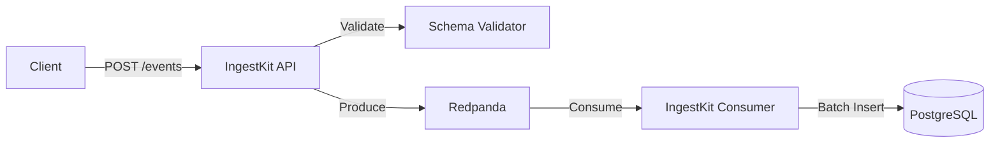

# IngestKit

> **High-Performance Event Ingestion System**
> *Handle 30k+ RPS on a $14 server with zero data loss.*

[](LICENSE)
[](https://goreportcard.com/report/github.com/feat7/ingestkit)
[]()

IngestKit is an open-source event ingestion platform designed for developers who need to collect massive amounts of data without breaking the bank. It decouples ingestion from storage using a modern Producer-Consumer architecture, ensuring your API never slows down even when your database is under load.

---

## Why IngestKit?

### Unmatched Performance
*   **30,000+ RPS** on a single $14/month Hetzner server (CAX31: 8 vCPU, 16GB RAM).
*   **Zero Data Loss**: Durable buffering via Redpanda (Kafka-compatible).
*   **Async & Sync Modes**: Choose between fire-and-forget (HTTP 202) or guaranteed delivery (HTTP 200).

### Developer Experience
*   **Schema-First**: Define events in `events.yaml`, and we generate the Go code, SQL schemas, and validation logic for you.
*   **Type-Safe**: Automatic validation of every incoming event.
*   **One-Command Deploys**: `make start` gets you a full stack (API, Consumer, Postgres, Redpanda) in seconds.

### Built for Reliability
*   **Dead Letter Queues**: Failed events are never lost, just sidelined for inspection.
*   **Multi-Tenant**: Built-in API key management and tenant isolation.
*   **Observability**: Prometheus metrics and structured JSON logging out of the box.

---

## Architecture

IngestKit uses a decoupled architecture to ensure high availability and throughput.



**[Read the Full Project Overview](PROJECT_OVERVIEW.md)** for deep dives into the architecture, data flow, and component details.

---

## Quick Start

### Prerequisites
*   Docker & Docker Compose
*   Go 1.21+ (optional, for local dev)

### 1. Start the Stack
```bash
git clone https://github.com/feat7/ingestkit.git
cd ingestkit
make setup
make start
```
*This automatically builds and starts all services: API (port 8080), Consumer, Redpanda, and PostgreSQL (port 5433). Everything runs in Docker with zero configuration needed.*

### 2. Send an Event
```bash
curl -X POST http://localhost:8080/v1/events/user_signup \
  -H "Authorization: Bearer dev_key_1234567890" \
  -H "Content-Type: application/json" \
  -d '{
    "user_id": "user_123",
    "email": "hello@example.com",
    "signup_source": "web"
  }'
```

> **Note on Multi-tenancy**: The `Authorization` header contains your API Key. IngestKit uses this key to automatically handle **multi-tenancy**, isolating data for different environments or customers. You do **not** need to send a tenant ID in your event payload.

### 3. Check the Database
```bash
make db-connect
# SELECT * FROM events_user_signup;
```

---

## Configuration

IngestKit uses environment variables for configuration. The default settings work out of the box, but you can customize them:

```bash
cp .env.example .env
# Edit .env with your preferred values
```

**Key Configuration Options:**

| Variable | Default | Description |
|----------|---------|-------------|
| `POSTGRES_PORT` | `5433` | PostgreSQL external port (internal port is always 5432) |
| `API_PORT` | `8080` | API server port |
| `METRICS_PORT` | `8081` | Consumer metrics endpoint port |
| `API_KEY_1` | `dev_key_1234567890:default` | Default API key (format: `key:tenant_id`) |
| `RATE_LIMIT_RPS` | `20000` | API rate limit (requests per second) |
| `CONSUMER_WORKERS` | `4` | Number of consumer worker goroutines |
| `CONSUMER_BATCH_SIZE` | `500` | Max events per batch |

**Multi-Tenant API Keys:**
```bash
API_KEY_1=dev_key_1234567890:default
API_KEY_2=sk_test_tenant_alpha:tenant_alpha
API_KEY_3=dev_key_ecommerce:ecommerce-demo
```

---

## Benchmarks

We take performance seriously. Here is a real-world benchmark run on a **Hetzner CAX31** ($14/mo) instance running the *entire* stack (IngestKit API + Consumer + Redpanda + Postgres).

| Metric | Result |
| :--- | :--- |
| **Throughput** | **~28,500 - 30,000 RPS** |
| **Latency (p95)** | **< 15ms** |
| **Data Loss** | **0%** |
| **CPU Usage** | ~70% (API), ~40% (Consumer) |

*Note: These results were achieved using the `make loadtest-high` script included in the repo.*

---

## How to Add Custom Events

Adding a new event type is simple. Just edit `schema/events.yaml` and run the generator.

**1. Edit `schema/events.yaml`**

```yaml
events:
  # ... existing events ...
  
  # Add your new event
  subscription_upgraded:
    description: "Fired when a user upgrades their plan"
    fields:
      user_id:
        type: string
        required: true
        indexed: true
      old_plan:
        type: string
        required: true
      new_plan:
        type: string
        required: true
      amount:
        type: decimal
        required: true
      metadata:
        type: jsonb
        required: false
```

**2. Generate Code**

```bash
make generate
```

This command will automatically:
*   Create the Go struct `SubscriptionUpgraded` in `generated/models`.
*   Generate the SQL migration to create the `events_subscription_upgraded` table.
*   Update the validation logic to accept this new event type.

**3. Apply Changes**

```bash
make build
make db-migrate-up
```

**4. Send Event**

```bash
curl -X POST http://localhost:8080/v1/events/subscription_upgraded \
  -H "Authorization: Bearer dev_key_1234567890" \
  -H "Content-Type: application/json" \
  -d '{
    "user_id": "user_123",
    "old_plan": "free",
    "new_plan": "pro",
    "amount": 29.99,
    "metadata": {
      "reason": "black_friday_promo",
      "coupon": "BF2025"
    }
  }'
```

---

## SDK Generation

IngestKit comes with a built-in CLI to generate type-safe client libraries for your application.

### 1. Initialize
Run this in your project root (where you want the SDK to live):

```bash
# For Python
./bin/ingestkit init --python

# For TypeScript
./bin/ingestkit init --typescript
```

### 2. Generate Client
After editing `schema/events.yaml`, regenerate the client:

```bash
./bin/ingestkit generate
```

This creates a type-safe client in the `ingestkit/` directory that you can use immediately:

```python
# Python Example
from ingestkit import Client

client = Client()
client.user_signup.send(
    user_id="user_123",
    email="hello@example.com"
)
```

---

## Troubleshooting

### Services Not Starting?

**Check service status:**
```bash
make status
make health
```

**View logs:**
```bash
make docker-logs          # All services
make docker-logs-api      # API only
make docker-logs-consumer # Consumer only
```

### Port Conflicts?

If you see "port already in use" errors, edit `.env` to change ports:

```bash
POSTGRES_PORT=5434
API_PORT=8081
METRICS_PORT=8082
```

Then restart:
```bash
make down
make start
```

### Consumer Not Processing Events?

**Check consumer health:**
```bash
curl http://localhost:8081/health
```

**View consumer metrics:**
```bash
make metrics
```

**Check dead letter queue for failed events:**
```bash
make db-dlq-check
```

### Database Connection Issues?

**Verify database is healthy:**
```bash
docker compose exec postgres pg_isready -U ingestkit
```

**Reset database (⚠️ destroys all data):**
```bash
make db-reset
```

### Clean Slate Reset

If things are broken, start fresh:
```bash
make clean           # Stop and remove everything
make start           # Fresh start
```

---

## Documentation

*   **[Project Overview](PROJECT_OVERVIEW.md)**: Architecture and design.
*   **[Development Guide](docs/development.md)**: How to add new events and modify the schema.
*   **[Docker Deployment](docs/docker-deployment.md)**: Production deployment guide.
*   **[Load Testing](docs/load-testing.md)**: How to reproduce our benchmarks.
*   **[SDK Generation](docs/sdk-generation.md)**: Generate client libraries for your app.

---

## Contributing

We welcome contributions! Please see our [Contributing Guidelines](CONTRIBUTING.md) for details.

1.  Fork the repo
2.  Create your feature branch (`git checkout -b feature/amazing-feature`)
3.  Commit your changes (`git commit -m 'Add some amazing feature'`)
4.  Push to the branch (`git push origin feature/amazing-feature`)
5.  Open a Pull Request

## License

This project is licensed under the Apache 2.0 License - see the [LICENSE](LICENSE) file for details.
